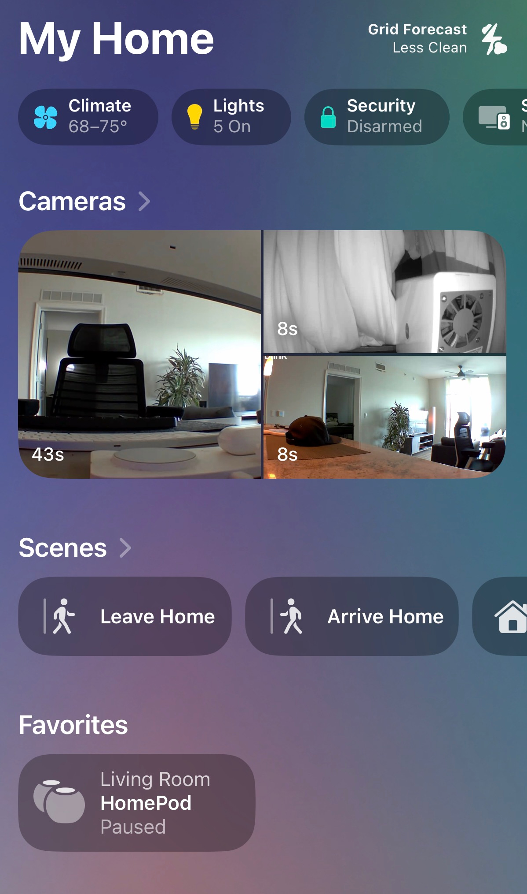
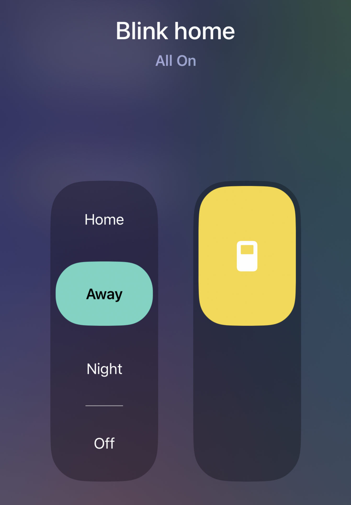
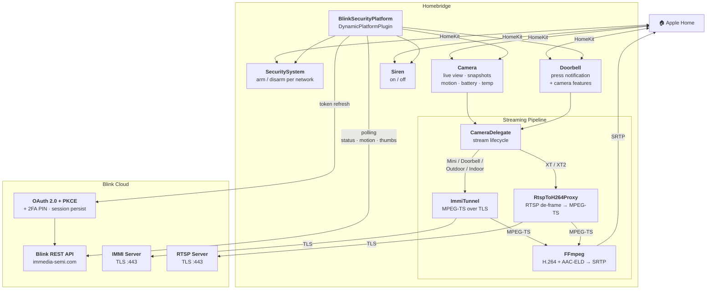
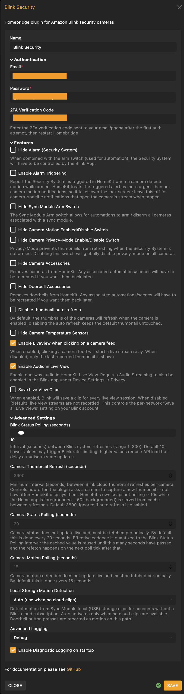
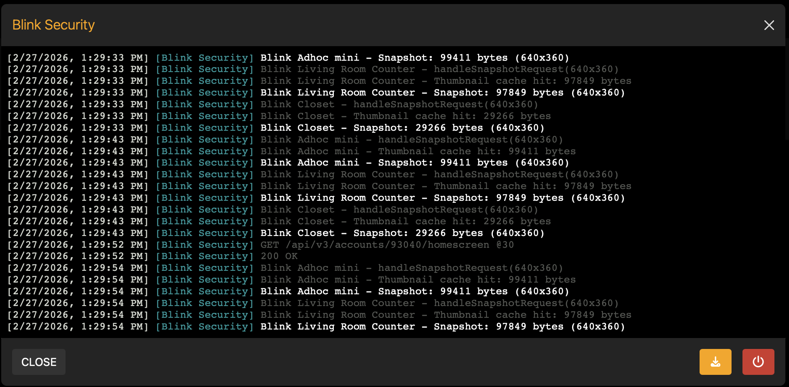

<span align="center">

<h1>
  <a href="https://github.com/BitWise-0x/homebridge-blink-security">
    
  </a>
  <br />
  Homebridge Blink Security
</h1>

[](https://github.com/homebridge/homebridge/wiki/Verified-Plugins)

[](https://www.npmjs.com/package/@jackietreeh0rn/homebridge-blink-security)
[](https://www.npmjs.com/package/@jackietreeh0rn/homebridge-blink-security)
[](https://github.com/BitWise-0x/homebridge-blink-security)
[](https://github.com/BitWise-0x/homebridge-blink-security)
[](https://github.com/BitWise-0x/homebridge-blink-security/pulls)
[](https://github.com/BitWise-0x/homebridge-blink-security/issues)
[](https://app.fossa.com/projects/custom%2B56237%2Fgithub.com%2FBitWise-0x%2Fhomebridge-blink-security?ref=badge_shield&issueType=license)

<!-- [](https://app.fossa.com/projects/git%2Bgithub.com%2FBitWise-0x%2Fhomebridge-blink-security?ref=badge_shield&issueType=security) -->
<br>
The most comprehensive <a href="https://homebridge.io">Homebridge</a> plugin for <a href="https://blinkforhome.com">Amazon Blink</a> cameras, doorbells, and sirens. Brings your Blink devices into <a href="https://www.apple.com/ios/home/">Apple Home</a> with live view, motion detection, snapshots, and arm/disarm.

</span>
<br><br>
<p align="center">
  
  &nbsp;&nbsp;&nbsp;&nbsp;
  
</p>

<br>

## Supported Devices

<div align="center">

| Device                    | Model Type            | Capabilities                                                                                                                                                                                                                    |
| ------------------------- | --------------------- | ------------------------------------------------------------------------------------------------------------------------------------------------------------------------------------------------------------------------------- |
| 📷 Blink Outdoor / Indoor | `default`, `catalina` | <ul><li>Live view (IMMI) + audio</li><li>Motion sensor</li><li>Snapshots</li><li>Temperature</li><li>Battery level</li><li>Night vision</li><li>Clip recording</li><li>Privacy mode</li><li>Motion enable/disable</li></ul>     |
| 📷 Blink XT / XT2         | `white`, `xt`         | <ul><li>Live view (RTSP, video only)</li><li>Motion sensor</li><li>Snapshots</li><li>Temperature</li><li>Battery level</li><li>Night vision</li><li>Clip recording</li><li>Privacy mode</li><li>Motion enable/disable</li></ul> |
| 📸 Blink Mini             | `owl`                 | <ul><li>Live view (IMMI) + audio</li><li>Motion sensor</li><li>Snapshots</li><li>Clip recording</li><li>Privacy mode</li><li>Motion enable/disable</li></ul>                                                                    |
| 📸 Blink Mini 2           | `hawk`                | <ul><li>Live view (IMMI) + audio</li><li>Motion sensor</li><li>Snapshots</li><li>Clip recording</li><li>Privacy mode</li><li>Motion enable/disable</li></ul>                                                                    |
| 📸 Blink Mini 2K+         | `chickadee`           | <ul><li>Live view (IMMI) + audio</li><li>Motion sensor</li><li>Snapshots</li><li>Clip recording</li><li>Privacy mode</li><li>Motion enable/disable</li></ul>                                                                    |
| 🔦 Blink Wired Floodlight | `superior`            | <ul><li>Live view (IMMI) + audio</li><li>Motion sensor</li><li>Snapshots</li><li>Clip recording</li><li>Privacy mode</li><li>Motion enable/disable</li></ul>                                                                    |
| 🚪 Blink Video Doorbell   | `lotus`               | <ul><li>Live view (IMMI) + audio</li><li>Motion sensor</li><li>Snapshots</li><li>Doorbell press notification</li><li>Clip recording</li><li>Privacy mode</li><li>Motion enable/disable</li></ul>                                |
| 🚨 Blink Siren            | siren                 | <ul><li>On/off switch</li></ul>                                                                                                                                                                                                 |

</div>

> **Newer models work automatically.** Model types are listed for reference
> only. The plugin routes each device by how the Blink account reports it,
> not by its model string, so hardware released after this table (for
> example the 2K+ outdoor cameras and doorbells) is supported without a
> plugin update. If a device does not appear in HomeKit at all, open an
> issue with your startup log.

<br>

## Architecture



<br>

## Features

- **Live view**: IMMI and RTSP streaming via ffmpeg with automatic keepalive (H.264 video, AAC-ELD audio on IMMI cameras)
- **Security system**: Arm/disarm per network, with optional manual arm switch and opt-in alarm triggering on motion (`enable-alarm-triggering`)
- **Multi-network**: Supports multiple sync modules, each with independent arm/disarm
- **Motion detection**: Motion events surfaced to HomeKit by polling the Blink cloud (configurable interval, with debounce). Blink has no public push API, so detection trails the Blink app's own notification by roughly the clip upload time plus one poll cycle
- **Local storage motion**: Motion notifications without a Blink subscription. Accounts with no cloud storage use clips saved to the Sync Module's USB drive instead (`local-storage-motion`)
- **Motion enable/disable**: Per-camera switch to turn motion detection on or off
- **Snapshots**: Periodic thumbnail refresh with caching and retry
- **Battery**: Battery level and low-battery alerts (Outdoor/Indoor models)
- **Temperature**: Ambient temperature sensor (Outdoor/Indoor models)
- **Doorbell press**: Doorbell button presses raised as HomeKit doorbell events. HomeKit delivers the push notification; detection is via cloud polling, like motion
- **Privacy mode**: Per-camera switch to suppress snapshots when disarmed
- **Night vision**: IR illuminator toggle (Outdoor/Indoor models)
- **Clip recording**: Trigger a clip recording via momentary switch
- **Live View clip saving**: Per-network `lv_save` toggle to save or suppress Live View clips
- **One-way audio**: Listen-in on IMMI cameras (Mini, Mini 2, Mini 2K+, Outdoor/Indoor, Doorbell, Floodlight) transcoded to AAC-ELD for HomeKit
- **OAuth 2.0 + PKCE**: Token refresh and persistent sessions across restarts
- **2FA**: One-time PIN verification for Blink's two-factor auth
- **Snapshot fallback**: Streams the last thumbnail when live view is unavailable
- **Stale accessory cleanup**: Removes devices no longer on your Blink account
- **Retry with backoff**: Automatic retry on network errors and rate limiting

<br>

## Installation

[Install Homebridge](https://github.com/homebridge/homebridge/wiki), add it to [Apple Home](https://github.com/homebridge/homebridge/blob/main/README.md#adding-homebridge-to-ios), then install and configure Homebridge Blink Security.

### Recommended

1. Open the [Homebridge UI](https://github.com/homebridge/homebridge/wiki/Install-Homebridge-on-macOS#complete-login-to-the-homebridge-ui).

2. Open the Plugins tab, search for `homebridge-blink-security`, and install the plugin.

3. Configure your Blink credentials through the settings panel.

<p align="center">
  
</p>

<p align="center">
  
</p>

### Manual

1. Install the plugin using NPM:

   ```sh
   npm i -g @jackietreeh0rn/homebridge-blink-security
   ```

2. Configure the BlinkSecurity platform in `~/.homebridge/config.json` as shown in [`config.example.json`](./config.example.json).

3. Start Homebridge:

   ```sh
   homebridge -D
   ```

<br>

## 2FA Setup

Blink requires two-factor authentication on first login:

1. Configure your `username` and `password` and restart Homebridge
2. Blink will send a verification code to your email/phone
3. Add the code to the `pin` field in config and restart Homebridge
4. After successful verification, remove the `pin` field; the session is persisted

<br>

## Configuration

| Property                           | Type    | Default    | Description                                                                                                                                                                                                                                                                                                                                                                                                                 |
| ---------------------------------- | ------- | ---------- | --------------------------------------------------------------------------------------------------------------------------------------------------------------------------------------------------------------------------------------------------------------------------------------------------------------------------------------------------------------------------------------------------------------------------- |
| `username`                         | string  | _required_ | Blink account email                                                                                                                                                                                                                                                                                                                                                                                                         |
| `password`                         | string  | _required_ | Blink account password                                                                                                                                                                                                                                                                                                                                                                                                      |
| `pin`                              | string  |            | 2FA verification code (only needed once)                                                                                                                                                                                                                                                                                                                                                                                    |
| `hide-alarm`                       | boolean | `false`    | Hide the SecuritySystem accessory                                                                                                                                                                                                                                                                                                                                                                                           |
| `enable-alarm-triggering`          | boolean | `false`    | Report the SecuritySystem as triggered when a camera detects motion while armed. Off by default: the triggered alert outranks per-camera motion notifications in HomeKit, so leaving it off keeps notifications camera-specific (tapping opens that camera's stream)                                                                                                                                                        |
| `hide-manual-arm-switch`           | boolean | `false`    | Hide the manual arm/disarm switch                                                                                                                                                                                                                                                                                                                                                                                           |
| `hide-temperature-sensor`          | boolean | `false`    | Hide temperature sensors on cameras                                                                                                                                                                                                                                                                                                                                                                                         |
| `hide-enabled-switch`              | boolean | `false`    | Hide motion enabled/disabled switch                                                                                                                                                                                                                                                                                                                                                                                         |
| `hide-privacy-switch`              | boolean | `false`    | Hide privacy mode switch                                                                                                                                                                                                                                                                                                                                                                                                    |
| `hide-cameras`                     | boolean | `false`    | Removes cameras from HomeKit. Rooms, automations, scenes, and custom names will not be restored if toggled back off                                                                                                                                                                                                                                                                                                         |
| `hide-doorbells`                   | boolean | `false`    | Removes doorbells from HomeKit. Rooms, automations, scenes, and custom names will not be restored if toggled back off                                                                                                                                                                                                                                                                                                       |
| `enable-liveview`                  | boolean | `true`     | Enable IMMI live view streaming                                                                                                                                                                                                                                                                                                                                                                                             |
| `enable-audio`                     | boolean | `false`    | Enable one-way audio in Live View. Also requires Audio Streaming in the Blink app under Device Settings → Privacy                                                                                                                                                                                                                                                                                                           |
| `lv-save`                          | boolean | `false`    | Save Live View clips to Blink cloud                                                                                                                                                                                                                                                                                                                                                                                         |
| `disable-thumbnail-refresh`        | boolean | `false`    | Disable automatic thumbnail refresh                                                                                                                                                                                                                                                                                                                                                                                         |
| `blink-status-polling-seconds`     | integer | `10`       | Seconds between Blink system refreshes (range 1-300). Default 10. Lower values may trigger Blink rate-limiting; higher values reduce API load but delay arm/disarm state updates                                                                                                                                                                                                                                            |
| `camera-thumbnail-refresh-seconds` | integer | `3600`     | Minimum seconds between Blink cloud thumbnail refreshes per camera (HomeKit polls and is served cached thumbnails between refreshes)                                                                                                                                                                                                                                                                                        |
| `camera-status-polling-seconds`    | integer | `20`       | Camera status polling interval in seconds. Effective cadence rounds up to the next `blink-status-polling-seconds` tick                                                                                                                                                                                                                                                                                                      |
| `camera-motion-polling-seconds`    | integer | `15`       | Motion detection polling interval in seconds. Effectively capped at `blink-status-polling-seconds`; a longer value would only add notification latency without reducing API load                                                                                                                                                                                                                                            |
| `local-storage-motion`             | string  | `"auto"`   | Detect motion from Sync Module local (USB) storage clips on accounts without cloud clip storage. `"auto"` engages only while no cloud clips exist; `"always"` / `"never"` force it on or off. Local clips are checked every ~20s, clips already on the drive at startup are never replayed as motion, and doorbell button presses are reported as motion on this path (Blink's local manifest does not distinguish presses) |
| `logging`                          | string  |            | `"quiet"` suppresses routine chatter (thumbnail refresh, reconfigure, clip recording, sleep). `"verbose"` or `"debug"` for extended logging                                                                                                                                                                                                                                                                                 |
| `enable-startup-diagnostic`        | boolean | `false`    | Log diagnostic info on startup                                                                                                                                                                                                                                                                                                                                                                                              |

<br>

## Development

### Prerequisites

- Node.js 18.20.4+, 20.18.0+, 22.10.0+, or 24.0.0+
- Homebridge 1.8.0+ or 2.0.0-beta+

FFmpeg is bundled via the [`ffmpeg-for-homebridge`](https://github.com/homebridge/ffmpeg-for-homebridge) dependency. No separate install is needed, and it ships with `libfdk_aac` enabled for AAC-ELD audio.

### Setup

```sh
npm install
npm run build
npm link
```

### Watch Mode

Automatically recompiles and restarts Homebridge on source changes:

```sh
npm run watch
```

This runs a local Homebridge instance in debug mode using the config at `./test/hbConfig/`. Stop any other Homebridge instances first to avoid port conflicts. The watch behavior can be adjusted in [`nodemon.json`](./nodemon.json).

### Linting & Formatting

```sh
npm run lint        # check for lint errors
npm run lint:fix    # auto-fix lint errors
npm run prettier    # check formatting
npm run format      # auto-fix formatting
```

Commits must follow [Conventional Commits](https://www.conventionalcommits.org/en/v1.0.0/#summary), enforced by pre-commit hooks via [commitlint](https://commitlint.js.org/) and [husky](https://typicode.github.io/husky/).

### Dependency Updates

Dependabot opens grouped pull requests weekly, configured in [`.github/dependabot.yml`](./.github/dependabot.yml). Production and development dependencies are each split into a minor/patch group and a major group. The [Dependabot Auto Merge](./.github/workflows/dependabot-merge.yml) workflow enables auto-merge on patch and minor updates, so they land on their own once CI passes. Major updates stay open for manual review. Auto-merge is enabled with the `GH_TOKEN` secret rather than the workflow's own `GITHUB_TOKEN`: merges made with `GITHUB_TOKEN` do not trigger push workflows, so the merged commit would land on `main` without Build or Release running.

`prettier` is excluded from the development group. A Prettier minor can change formatting output, which fails the formatting check and would hold up every other update in the group. It gets its own pull request and usually needs an `npm run format` commit before it merges.

Dependabot only tracks direct dependencies. Advisories against transitive packages, including ones bundled inside another package's tarball (for example `npm`, pulled in by `@semantic-release/npm`), show up as alerts without a pull request. Resolve those by raising the matching floor in the `overrides` block of `package.json` and regenerating the lockfile:

```sh
npm install --package-lock-only
npm audit --omit=dev
```

`npm audit --omit=dev` only covers production dependencies, so a clean result can coexist with open development-scope alerts. Check the repository's Dependabot alerts page for those.

### Releases

Every push to `main` runs [semantic-release](https://semantic-release.gitbook.io/) with the `conventionalcommits` preset. `feat` commits cut a minor release, `fix` and `perf` a patch, and a `BREAKING CHANGE` footer a major. Other types (`docs`, `chore`, `ci`, `build`, `style`, `refactor`, `test`) do not release. Each release updates `CHANGELOG.md`, tags the commit, publishes to npm, and creates a GitHub release.

Publishing requires two repository secrets: `NPM_TOKEN`, a valid npm automation token, and `GH_TOKEN`, a personal access token with contents and pull-requests write access that semantic-release uses to push the changelog commit and tag and to create the GitHub release (the Dependabot auto-merge workflow uses the same token). If the Release workflow fails with `EINVALIDNPMTOKEN`, generate a new npm token, update the secret, and re-run the failed job. `EINVALIDGHTOKEN` means the same for `GH_TOKEN`. A run that stops with "local branch main is behind the remote one" published nothing; it happens when another commit reaches `main` mid-run, and the next successful run picks up every unreleased commit.

<br>

## Troubleshooting

### No Audio in Live View

One-way audio is supported on IMMI cameras (Mini, Mini 2, Mini 2K+, Outdoor/Indoor, Doorbell, Wired Floodlight). XT / XT2 cameras use RTSP and are video-only.

Audio is opt-in. To enable it:

1. Set `enable-audio: true` in plugin config
2. Open the Blink app → Device Settings → Privacy → enable Audio Streaming for each camera
3. Restart the child bridge

If Audio Streaming is disabled in the Blink app, the camera sends malformed audio metadata that stalls the stream. That is why audio defaults to off.

### Live View shows "Not responding"

If Live View spins and eventually shows "Not responding" in the Home app, the most common cause is audio being enabled in plugin config while Audio Streaming is disabled in the Blink app for that camera. Either enable Audio Streaming in the Blink app, or set `enable-audio: false` in plugin config.

### No HomeKit notifications at all

Notification preferences live in iOS, not in the plugin, and they are per accessory and default to off for new accessories. To enable them for each camera:

1. Open the Home app and long-press the camera
2. Tap the settings (gear) icon
3. Tap **Status and Notifications**
4. Turn on **Activity Notifications**
5. Check the **Time** and **People** conditions underneath; "only when I'm not home" is a common silent default that drops every notification while you are home

Arm/disarm alerts have their own toggle: repeat the same steps on the security system tile.

These settings reset whenever HomeKit sees an accessory as new: re-pairing the bridge, removing and re-adding a device, or migrating from another Blink plugin all create new accessories with notifications off, even though the Home app shows the same names. If notifications stop after one of those events, re-enable them.

### HomeKit notifications arrive later than the Blink app

The Blink app is notified by Blink's private push service the moment a camera starts recording. There is no public push API, so the plugin can only discover an event by polling the cloud media list, and a clip only appears there after it has finished recording and uploading. In practice HomeKit notifications land roughly 5 to 20 seconds behind the Blink app. Lowering `blink-status-polling-seconds` shaves a few seconds at the cost of more API requests; the upload time cannot be avoided.

### No motion notifications without a Blink subscription

Accounts without a cloud storage plan have an empty cloud media list, so cloud polling finds nothing to report. Put a USB drive in the Sync Module and enable Local Storage in the Blink app; the plugin then detects motion from the sync module's local storage manifest instead. The startup log shows what the plugin sees, e.g. `Local storage: compatible=true, enabled=true, status=active`. The `local-storage-motion` option controls the fallback; the default `auto` engages it only while the cloud media list is empty.

### Motion notifications point at the Security System instead of the camera

That is `enable-alarm-triggering`: when on, motion while armed reports the Security System as triggered, and HomeKit treats that alert as more urgent than the per-camera motion notifications. Leave it off (the default) for camera-specific notifications that open that camera's stream when tapped. Per-camera notifications also require Activity Notifications to be enabled for each camera in the Home app, and motion only fires while the system is armed.

### VPN Interference

Blink's authentication servers may reject login requests made through a VPN, returning HTTP 406 with no 2FA code sent. If you're unable to complete initial setup:

1. Disconnect your VPN
2. Restart the Homebridge child bridge
3. Complete 2FA verification
4. You can re-enable your VPN after authentication succeeds; sessions are persisted

### General

If you run into issues, check the [Homebridge troubleshooting wiki](https://github.com/homebridge/homebridge/wiki/Basic-Troubleshooting) first. If the problem persists, [open an issue](https://github.com/BitWise-0x/homebridge-blink-security/issues/new/choose) with as much detail as possible.

<br>

## Contributing

See [CONTRIBUTING.md](./CONTRIBUTING.md) for guidelines on bug reports, feature requests, and code contributions.

<br>

## Useful Resources

> **Read the full write-up:** [Homebridge SmartRent & Blink](https://blog.bitwise0x.com/blog/homebridge-smartrent-blink), an architectural deep-dive into how both plugins map their respective APIs into HomeKit (HAP service composition, IMMI streaming, OAuth/2FA, motion polling).

- [MattTW/BlinkMonitorProtocol](https://github.com/MattTW/BlinkMonitorProtocol): Blink API documentation
- [fronzbot/blinkpy](https://github.com/fronzbot/blinkpy): Python Blink library (Home Assistant)
- [Homebridge Developer Documentation](https://developers.homebridge.io/)
- [Apple HomeKit Documentation](https://developer.apple.com/documentation/homekit/)

<br>

## License

[GNU GENERAL PUBLIC LICENSE, Version 3](https://www.gnu.org/licenses/gpl-3.0.en.html)

<!-- [](https://app.fossa.com/projects/custom%2B56237%2Fgithub.com%2FBitWise-0x%2Fhomebridge-blink-security?ref=badge_large&issueType=license) -->

<br>

## Disclaimer

This project is not endorsed by, directly affiliated with, maintained, authorized, or sponsored by Amazon.com, Inc., Immedia Semiconductor, or Apple Inc. All product and company names are the registered trademarks of their original owners. The use of any trade name or trademark is for identification and reference purposes only and does not imply any association with the trademark holder of their product brand.
